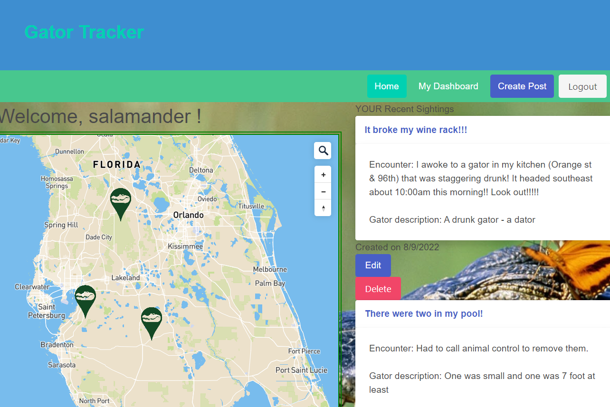

# Gator Tracker

## Application Description
This full-stack website is a gator sighting tracker. All who visit the site are able to see posts of gator sightings with a map and comments on the home page. To post or comment a user must sign in. Users can either login or sign up with a name, username, email, and password. Upon signing in, they can see the dashboard where they can add a new post or edit or delete an existing one and be brought back to a refreshed dashboard. They can also comment on posts once logged in. 

## Challenge Description
This challenge began by creating a database, seed data, and models for mysql. Then backend api routes for get/post/put/delete were created and tested in insomnia. Then routes were created for rendering the front end webpages via handlebars. Finally these were connected to the handlebar html pages with public JavaScript files for button handling and css styling which were able to be viewed on localhost and are deployed to Heroku. 

## User Story

```
AS A Floriadian who frequently comes into dangerous encounters with alligators
I WANT a sightings website with a map
SO THAT I can contribute and view sightings including the description of the alligator, date seen, and location
```

## Acceptance Criteria

```
Use Node.js and Express.js to create a RESTful API.

Use Handlebars.js as the templating engine.

Use MySQL and the Sequelize ORM for the database.

Have both GET and POST routes for retrieving and adding new data.

Be deployed using Heroku (with data).

Use at least one new library, package, or technology that we haven’t discussed.

Have a polished UI.

Be responsive.

Be interactive (i.e., accept and respond to user input).

Have a folder structure that meets the MVC paradigm.

Include authentication (express-session and cookies).

Protect API keys and sensitive information with environment variables.

Have a clean repository that meets quality coding standards (file structure, naming conventions, follows best practices for class/id naming conventions, indentation, quality comments, etc.).

Have a quality README (with unique name, description, technologies used, screenshot, and link to deployed application).

```

## Tasks Completed
The JavaScript documents include:
* api routes for post/get/put/delete, webpage rendering routes for use with handlebars, event listeners for each generated pages button functions
* node modules such as bcrypt, connect-session-sequelize, dotenv, express, express-handlebars, express-session, mysql2, nodemon, sequelize
* models for mysql table data
* comments

The Handlebars documents include:
* data rendered to html pages from the homeroutes
* for each arrays for dynamically rendered data, such as displaying newly added posts and comments
* if statements to display content or options only if a user is logged in

The JSON documents include:
* seed data for users, posts, and comments


## Languages
- JavaScript
- HTML
- CSS
- Handlebars


## Links
* [Deployed Application](https://gator-tracker-app.herokuapp.com/)

* [Repository](https://github.com/villettec/Project-2)

## Screenshots


## Credit
Villette Comfort: 

[Villette's GitHub Profile](https://github.com/villettec)

Tracy Guajardo: 

[Tracy's GitHub Profile](https://github.com/tracyroseguajardo)

Katlyn Green: 

[Katlyn's GitHub Profile](https://github.com/batgal)

Gerardo Garcia: 

[Gerardo's GitHub Profile](https://github.com/1ggarcia101)